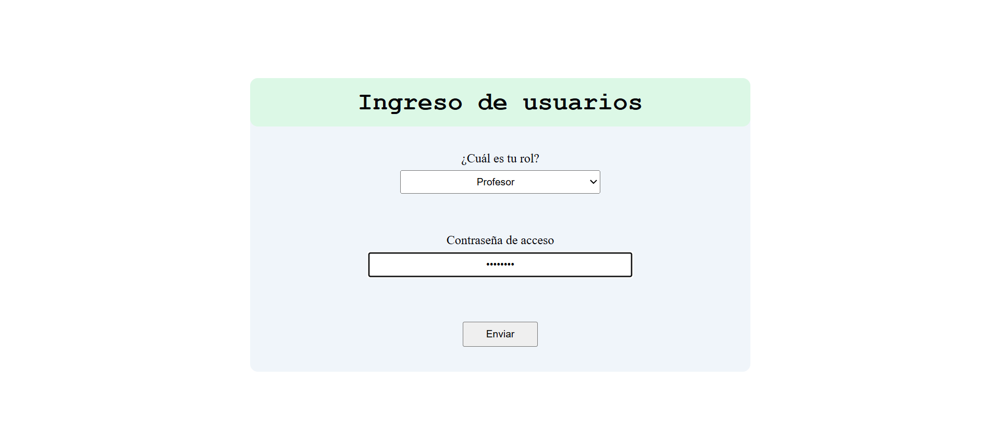
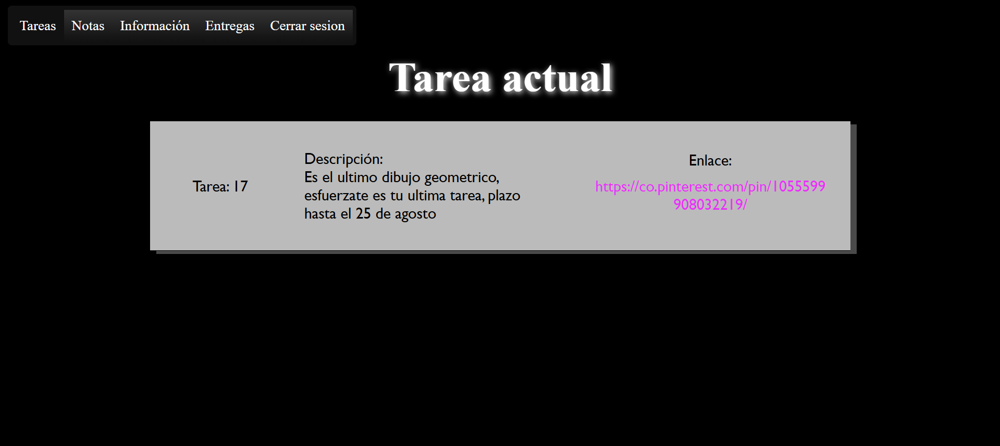
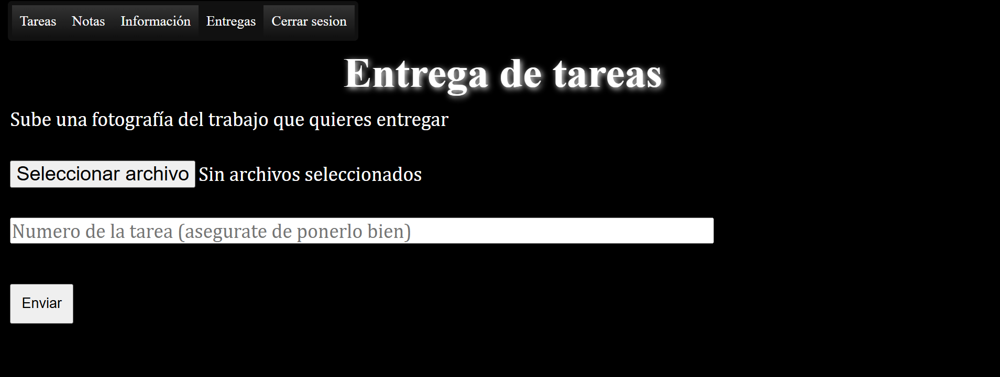
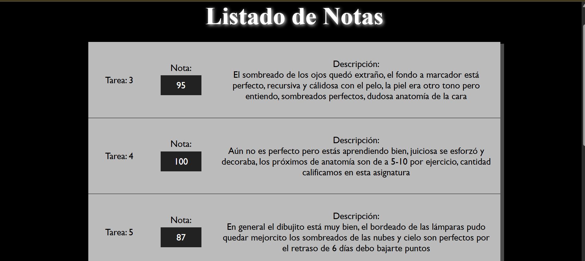
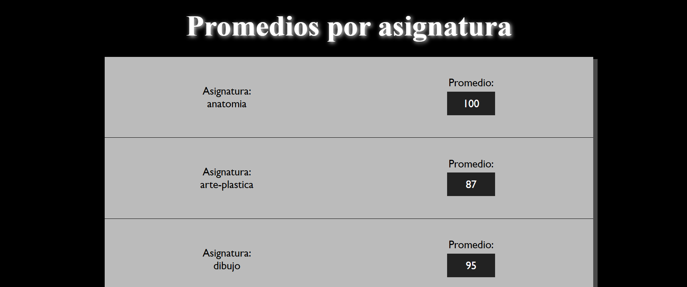
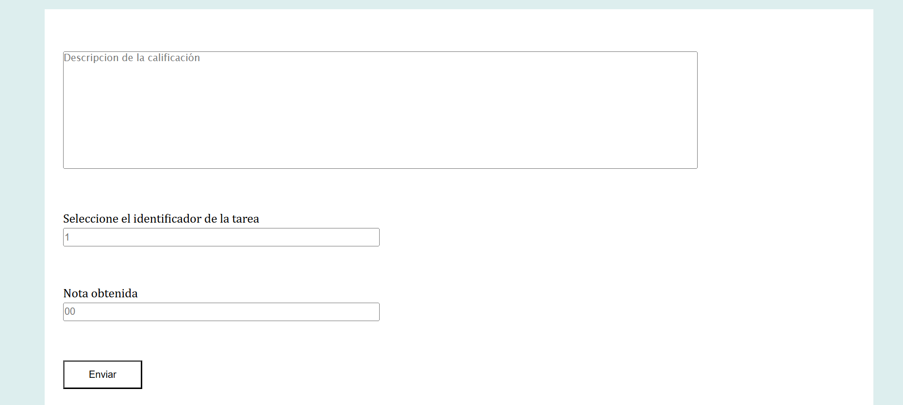

# Pagina_escolar

Aplicativo web para envío y recepción de tareas de un profesor partícular con su alumno

------

## Funcionalidades
- Envío de entregas de las tareas en formato image
- Visualización de las entregas del estudiante
- Login diferenciado para profesor y alumno
- Calificación de los trabajos
- Promedios automáticos por asignatura

## Tecnologías usadas
- HTML5
- CSS3
- PHP
- MySql
- Javascript

## capturas

## LOGIN

## Tarea en desarrollo

## Interfaz de entrega

## Listado de notas

## Promedios de calificación

## GUI Profesor

